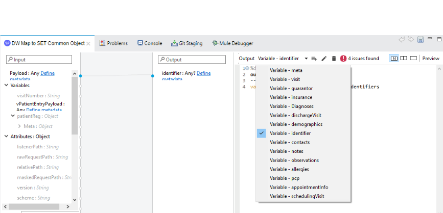

= Redox Connector

== ⦁    DOCUMENT REVISION HISTORY

[%header%autowidth.spread]
|===
|Version  |Release Date |Revised by |Comments/ Indicate Sections Revised
|1.0.0 |2020-08 |Connector Development Team |
|===

== ⦁    INTRODUCTION
⦁   *Purpose*

This specification document outlines the instructions for using Redox Connector operations.

⦁   *Background*

Redox provides integration infrastructure that can be managed by your team through a single platform and connection. The Redox integration platform has been built based on experience with millions of messages, thousands of HL7 feeds and EHR vendor API calls, and with hundreds of healthcare organizations and healthcare software providers.

⦁   *Overview*

Redox exists to improve healthcare by uniting patients and providers through easily accessible technology. Technology can dramatically improve healthcare. It helps healthcare organizations become more efficient. It gives patients more control of their healthcare experience. And when done right, technology removes distractions so providers can focus on what’s important: their patients.

*A high-level diagram of the architecture is shown below*

== ⦁	LIST OF OPERATIONS SUPPORTED BY THE REDOX CONNECTOR:
== Query

[%header%autowidth.spread]
|===
|Sr.No |Business Function |Operations |Description |Inbound |Outbound
|1 |Clinical Summary(PatientQuery) |POST Request |PatientQuery finds and returns the most recent Clinical Summary for a given patient at the specified health system. | Required fields are *Meta.DataModel,* *Meta.EventType,* *Patient.Identifiers[].ID,* *Patient.Identifiers[].IDType* |Returns JSON Response
|2 |Clinical Summary(VisitQuery) |POST Request |This query finds and returns visit summaries for a given patient at the specified health system within the specified timeframe. |Required fields are *Meta.DataModel,* *Meta.EventType,* *Patient.Identifiers[].ID,* *Patient.Identifiers[].IDType* |Returns JSON Response
|3 |Media(Query) |POST Request |This query can be used to retrieve Media documents based on the specified filter criteria. The format of the response is specified by the Media QueryResponse event type. |Required fields are *Meta.DataModel,* *Meta.EventType* |Returns JSON Response
|4 |Notes(Query) |POST Request |This query can be used to retrieve Notes documents based on the specified filter criteria. The format of the response is specified by the Notes QueryResponse event type. |Required fields are *Meta.DataModel,* *Meta.EventType,* |Returns JSON Response
|5 |Patient Admin(CensusQuery) |POST Request |The CensusQuery allows searching for all currently admitted patients from a facility. The response includes patient demographics and visit identifying information. |Required fields are *Meta.DataModel,* *Meta.EventType* |Returns JSON Response
|6 |Results(Query) |POST Request |This query finds and returns results that match the query criteria. The response for this query is the Results:QueryResponse event type. When using this query, the required elements and populated response will be variable depending on the system you are integrating with. Your Redox team will provide details on which elements are required by the EHR during your install process. |Required fields are *Meta.DataModel,* *Meta.EventType* |Returns JSON Response
|7 |Scheduling(AvailableSlots) |POST Request |This query finds and returns times available for booking an appointment within a given time range.  |Required fields are *Meta.DataModel*, *Meta.EventType*, *StartDateTime*  |Returns JSON Response
|8 |Scheduling(Booked) |POST Request |This query finds and returns booked appointments within a given time range. |Required fields are *Meta.DataModel*, *Meta.EventType*, *StartDateTime*  |Returns JSON Response
|9 |PatientSearch(Query) |POST Request |The Patient Search query will use a subset of patient demographic information to find a patient record match. This is often useful to retrieve the specific identifiers required for subsequent calls on a patient chart. |Required fields are *Meta.DataModel,* *Meta.EventType* |Returns JSON Response
|10 |Provider(ProviderQuery) |POST Request |This query finds and returns matching providers given the provided search parameter. The response for this query is the ProviderQueryResponse.When using this query, the required elements and populated response will be variable depending on the system you are integrating with. Your Redox team will provide details on which elements are required by the EHR during your install process. |Required fields are *Meta.DataModel,* *Meta.EventType* |Returns JSON Response
|11 |Referral(Query) |POST Request |The Referral Query will use a subset of patient demographic and insurance information to find matching referral records.|Required fields are *Meta.DataModel,* *Meta.EventType,* *Patient.Identifiers[].ID,* *Patient.Identifiers[].IDType*|Returns JSON Response

|===

== Endpoint
[%header%autowidth.spread]
|===
|Sr.No |Business Function |Operations |Description |Inbound |Outbound
|1 |Clinical Summary(PatientPush) |POST Request |Use PatientPush to send a Clinical Summary to another application or to an EHR or HIE as a Continuity of Care Document (CCD).|Required fields are *Header.Document.ID,* *Header.Document.Locale,* *Header.Document.Title,* *Header.Document.DateTime,* *Header.Patient.Identifiers[].ID,* *Header.Patient.Identifiers[].IDType,* *Header.Patient.Demographics.FirstName,* *Header.Patient.Demographics.LastName,* *Header.Patient.Demographics.DOB,* *Header.Patient.Demographics.Sex,* *Header.Document.Visit.VisitNumber,* *AdvanceDirectives[].Type.Code,* *AdvanceDirectives[].Code,* *AdvanceDirectives[].StartDate,* *Allergies[].Type.Code,* *Allergies[].Substance.Code,* *Allergies[].Reaction[].Code,* *Allergies[].Status.Code,* *Encounters[].Type.Code,* *Encounters[].DateTime,* *FamilyHistory[].Relation.Code,* *FamilyHistory[].Problems[].Code,* *FamilyHistory[].Problems[].Type.Code,* *Immunizations[].DateTime,* *Immunizations[].Product.Code,* *MedicalEquipment[].Status,* *Medications[].Prescription,* *Medications[].StartDate,* *Medications[].Product.Code,* *Problems[].Code,* *Problems[].Category.Code,* *Results[].Code,* *Results[].Status,* *Results[].Observations[].Code,* *Results[].Observations[].Status,* *Results[].Observations[].DateTime,* *Results[].Observations[].Value,* *Results[].Observations[].Units,* *VitalSigns[].Observations[].Code,* *VitalSigns[].Observations[].Status,* *VitalSigns[].Observations[].DateTime,* *VitalSigns[].Observations[].Value,* *VitalSigns[].Observations[].Units*  |Returns JSON Response
|2 |Clinical Summary(VisitPush) |POST Request |Use VisitPush to send a Visit Summary to another application or to an EHR. |Required fields are *Header.Document.ID,* *Header.Document.Locale,* *Header.Document.Title,* *Header.Document.DateTime,* *Header.Patient.Identifiers[].ID,* *Header.Patient.Identifiers[].IDType,* *Header.Patient.Demographics.FirstName,* *Header.Patient.Demographics.LastName,* *Header.Patient.Demographics.DOB,* *Header.Patient.Demographics.Sex,* *Header.Document.Visit.VisitNumber,* *AdvanceDirectives[].Type.Code,* *AdvanceDirectives[].Code,* *AdvanceDirectives[].StartDate,* *Allergies[].Type.Code,* *Allergies[].Substance.Code,* *Allergies[].Reaction[].Code,* *Allergies[].Status.Code,* *ChiefComplaintText,* *Encounters[].Type.Code,* *Encounters[].DateTime,* *FamilyHistory[].Relation.Code,* *FamilyHistory[].Problems[].Code,* *FamilyHistory[].Problems[].Type.Code,* *Immunizations[].DateTime,* *Immunizations[].Product.Code,* *InstructionsText,* *InterventionsText,* *MedicalEquipment[].Status,* *Medications[].Prescription,* *Medications[].StartDate,* *Medications[].Product.Code,* *MedicationsAdministered[].StartDate,* *MedicationsAdministered[].Product.Code,* *ObjectiveText,* *PhysicalExamText,* *Problems[].Code,* *Problems[].Category.Code,* *Results[].Code,* *Results[].Status,* *Results[].Observations[].Code,* *Results[].Observations[].Status,* *Results[].Observations[].DateTime,* *Results[].Observations[].Value,* *Results[].Observations[].Units,* *ReviewOfSystemsText,* *SubjectiveText,* *VitalSigns[].Observations[].Code,* *VitalSigns[].Observations[].Status,* *VitalSigns[].Observations[].DateTime,* *VitalSigns[].Observations[].Value,* *VitalSigns[].Observations[].Units* |Returns JSON Response
|3 |Clinical Decision(Request) |POST Request |The Clinical Decision Support (CDS) data model contains Request and Response events. The Request event is used to initiate the CDS workflow and communicate required information to the responding application, which can then use the Response event to send back clinical insights, observations, and recommendations. |Required fields are *Meta.DataModel,* *Meta.EventType,* *Patient.Identifiers[].ID,* *Patient.Identifiers[].IDType*, *UnsignedMedicationOrders[].Identifiers[].ID*, *UnsignedMedicationOrders[].Identifiers[].IDType*, *UnsignedProcedureOrders[].Identifiers[].ID,* *UnsignedProcedureOrders[].Identifiers[].IDType,* |Returns JSON Response
|4 |Clinical Decision(Response) |POST Request |The Clinical Decision Support (CDS) data model contains Request and Response events. The Request event is used to initiate the CDS workflow and communicate required information to the responding application, which can then use the Response event to send back clinical insights, observations, and recommendations. |Required fields are *Meta.DataModel,* *Meta.EventType,* *Advisories[].Session,* |Returns JSON Response
|5 |Claim(Submission) |POST Request |A Submission message is used to send a payment request, typically from a healthcare provider to an insurer. This is commonly sent as an EDI 837 form by healthcare providers. |Required fields are *Meta.DataModel,* *Meta.EventType*, |Returns JSON Response
|6 |Claim(Payment) |POST Request |A Payment message is used to send a payment notification, typically from a payer to a healthcare provider, but it may be used in other situations where funds are transferred from one party to another. This is commonly sent as an EDI 835. |Required fields are *Meta.DataModel,* *Meta.EventType,* *Payments[].Patient.Identifiers[].ID,* *Payments[].Patient.Identifiers[].IDType* |Returns JSON Response
|7 |Device(New) |POST Request |A New message is used to add new observations from a device to a patient's chart. Multiple different observations may be included in one message. Note that patient information and visit information may be included. However, in most cases, the EHR maps the device ID either to the patient directly, or to a room/bed directly, and ignores the patient and visit information. |Required fields are *Meta.DataModel,* *Meta.EventType,* *Device.ID,* *Observations[].DateTime,* *Observations[].Code,* *Observations[].Value,* *Observations[].ValueType* |Returns JSON Response
|8 |Financial(Transaction) |POST Request |A Transaction event occurs when a new charge is posted to the patient account. |Required fields are *Meta.DataModel,* *Meta.EventType,* *Patient.Identifiers[].ID,* *Patient.Identifiers[].IDType,* *Transactions[].ID,* *Transactions[].Type,* *Transactions[].DateTimeOfService,* *Transactions[].Chargeable.Code* |Returns JSON Response
|9 |Financial(AccountUpdate) |POST Request |An AccountUpdate event occurs when a patient's account information needs to be updated. |Required fields are *Meta.DataModel,* *Meta.EventType,* *Patient.Identifiers[].ID,* *Patient.Identifiers[].IDType* |Returns JSON Response
|10 |Flowsheet(New) |POST Request |A New message is used to add a new observations to the flowsheet. Multiple different observations may be included in one message. |Required fields are *Meta.DataModel,* *Meta.EventType,* *Patient.Identifiers[].ID,* *Patient.Identifiers[].IDType,* *Observations[].DateTime,* *Observations[].Value,* *Observations[].ValueType,* *Observations[].Code* |Returns JSON Response
|11 |Inventory(Update) |POST Request |The Update event is for reading and writing supply metadata, such as how many are on hand, whether or not it is chargeable, and where the supply is located. This model will be exchanged with inventory management systems, the EHR, and other system who are responsible for consuming supplies. Update events occur when the database updates are made in the inventory management system. |Required fields are *Meta.DataModel,* *Meta.EventType,* *Items[].Identifiers[].ID,* *Items[].Identifiers[].IDType* |Returns JSON Response
|12 |Inventory(Deplete) |POST Request |A Deplete event indicates that a supply has somehow been used. The optional Patient object provides a context for charging based on supply usage. Without the Patient object, the Deplete event can be used to document normal supply usage, and trigger automatic creation of a re-order (requisition). |Required fields are *Meta.DataModel,* *Meta.EventType,* *Items[].Identifiers[].ID,* *Items[].Identifiers[].IDType* |Returns JSON Response
|13 |Medications(New) |POST Request |Indicates a new request for a medication to be dispensed for the given patient. |Required fields are *Meta.DataModel,* *Meta.EventType,* *Patient.Identifiers[].ID,* *Patient.Identifiers[].IDType,* *Order.ID,* *Order.Medication.Product.Code* |Returns JSON Response
|14 |Medications(Update) |POST Request |Update messages are sent when some part of a medication order has been changed by the ordering system. |Required fields are *Meta.DataModel,* *Meta.EventType,* *Patient.Identifiers[].ID,* *Patient.Identifiers[].IDType,* *Order.ID,* *Order.Medication.Product.Code* |Returns JSON Response
|15 |Medications(Cancel) |POST Request |Indicates that a previous medication request has been cancelled by the ordering system. |Required fields are *Meta.DataModel,* *Meta.EventType,* *Patient.Identifiers[].ID,* *Patient.Identifiers[].IDType,* *Order.ID,* *Order.Medication.Product.Code* |Returns JSON Response
|16 |Medications(Administration) |POST Request |Administration events record that a patient received a given medication. |Required fields are *Meta.DataModel,* *Meta.EventType,* *Patient.Identifiers[].ID,* *Patient.Identifiers[].IDType,* *Administrations[].Status,* *Administrations[].Medication.Product.Code* |Returns JSON Response
|17 |Media(New) |POST Request |A New message is used to add a new document to the patient's chart. |Required fields are *Meta.DataModel,* *Meta.EventType,* *Patient.Identifiers[].ID,* *Patient.Identifiers[].IDType,* *Media.Provider.ID,* *Media.FileType,* *Media.FileName,* *Media.FileContents,* *Media.DocumentType,* *Media.DocumentID,* *Media.Availability* |Returns JSON Response
|18 |Media(Replace) |POST Request |A Replace Media message is used to replace a document that was previously added to the patient's chart. |Required fields are *Meta.DataModel,* *Meta.EventType,* *Patient.Identifiers[].ID,* *Patient.Identifiers[].IDType,* *Media.FileType,* *Media.FileName,* *Media.FileContents,* *Media.DocumentType,* *Media.OriginalDocumentID,* *Media.DocumentID,* *Media.Provider.ID,* *Media.Availability* |Returns JSON Response
|19 |Media(Delete) |POST Request |A Delete Media message is used to delete a document that was previously added to the patient's chart. |Required fields are *Meta.DataModel,* *Meta.EventType,* *Patient.Identifiers[].ID,* *Patient.Identifiers[].IDType,* *Media.FileType,* *Media.FileName,*  *Media.DocumentType,*  *Media.DocumentID,* *Media.Provider.ID,* *Media.Availability* |Returns JSON Response
|20 |Notes(New) |POST Request |A New message is used to add a new document to the patient's chart. |Required fields are *Meta.DataModel,* *Meta.EventType,* *Patient.Identifiers[].ID,* *Patient.Identifiers[].IDType,* *Note.ContentType,* *Note.DocumentType,* *Note.DocumentID,* *Note.Provider.ID* |Returns JSON Response
|21 |Notes(Replace) |POST Request |A Replace Note message is used to replace a document that was previously added to the patient's chart. |Required fields are *Meta.DataModel,* *Meta.EventType,* *Patient.Identifiers[].ID,* *Patient.Identifiers[].IDType,* *Note.ContentType,* *Note.DocumentType,* *Note.OriginalDocumentID,* *Note.DocumentID,* *Note.Provider.ID* |Returns JSON Response
|22 |Notes(Delete) |POST Request |A Delete Note message is used to delete a document that was previously added to the patient's chart. |Required fields are *Meta.DataModel,* *Meta.EventType,* *Patient.Identifiers[].ID,* *Patient.Identifiers[].IDType,* *Note.ContentType,* *Note.DocumentType,* *Note.DocumentID,* *Note.Provider.ID* |Returns JSON Response
|23 |Order(New) |POST Request |A New message is used when a new order is created. |Required fields are *Meta.DataModel,* *Meta.EventType,* *Patient.Identifiers[].ID,* *Patient.Identifiers[].IDType,* *Order.ID* |Returns JSON Response
|24 |Order(Update) |POST Request |An Update message is used when an existing order is updated. |Required fields are *Meta.DataModel,* *Meta.EventType,* *Patient.Identifiers[].ID,* *Patient.Identifiers[].IDType,* *Order.ID* |Returns JSON Response
|25 |Order(Cancel) |POST Request |An Cancel message is used when an existing order is canceled. |Required fields are *Meta.DataModel,* *Meta.EventType,* *Patient.Identifiers[].ID,* *Patient.Identifiers[].IDType,* *Order.ID* |Returns JSON Response
|26 |Order(GroupedOrders) |POST Request |The GroupOrders event can be used when multiple orders are sent in the same ordering session. |Required fields are *Meta.DataModel,* *Meta.EventType,* *Patient.Identifiers[].ID,* *Patient.Identifiers[].IDType,* *Orders[].ID,* *Orders[].Status*  |Returns JSON Response
|27 |Patient Admin(Arrival) |POST Request |An Arrival message is generated when a patient shows up for their visit or when a patient is admitted to the hospital. |Required fields are *Meta.DataModel,* *Meta.EventType,* *Patient.Identifiers[].ID,* *Patient.Identifiers[].IDType* |Returns JSON Response
|28 |Patient Admin(Cancel) |POST Request |A Cancel message is generated when a PatientAdmin event is canceled. The Meta.CanceledEvent field indicates which type of event the message cancels (e.g. Arrival, Discharge). For example, set Meta.EventType to "Cancel" and Meta.CanceledEvent to "Arrival" to cancel an arrival event. |Required fields are *Meta.DataModel,* *Meta.EventType,* *Patient.Identifiers[].ID,* *Patient.Identifiers[].IDType* |Returns JSON Response
|29 |Patient Admin(Discharge) |POST Request |A Discharge message is generated when a patient is discharged or checked out from a clinical stay or visit. |Required fields are *Meta.DataModel,* *Meta.EventType,* *Patient.Identifiers[].ID,* *Patient.Identifiers[].IDType* |Returns JSON Response
|30 |Patient Admin(NewPatient) |POST Request |The NewPatient event signals that a new patient has been created in the source system. Typically this will be followed with a more specific message such as a VisitUpdate message when a visit is created. |Required fields are *Meta.DataModel,* *Meta.EventType,* *Patient.Identifiers[].ID,* *Patient.Identifiers[].IDType* |Returns JSON Response
|31 |Patient Admin(PatientUpdate) |POST Request |A Patient Update message is generated when any patient or registration information changes while the patient is not currently admitted.|Required fields are *Meta.DataModel,* *Meta.EventType,* *Patient.Identifiers[].ID,* *Patient.Identifiers[].IDType* |Returns JSON Response
|32 |Patient Admin(VisitUpdate) |POST Request |A VisitUpdate message is generated when any patient or registration information changes. |Required fields are *Meta.DataModel,* *Meta.EventType,* *Patient.Identifiers[].ID,* *Patient.Identifiers[].IDType* |Returns JSON Response
|33 |Patient Admin(PreAdmit) |POST Request |A Pre-Admit event is used to prepare an admission or encounter. This event may allow for creating a patient, as well as creating a visit. For example, a pre-admit may be used prior to surgery so that lab tests can be performed. It may also be used to update the Emergency Department with an expected patient. |Required fields are *Meta.DataModel,* *Meta.EventType,* *Patient.Identifiers[].ID,* *Patient.Identifiers[].IDType* |Returns JSON Response
|34 |Patient Admin(Registration) |POST Request |A Registration message is generated when a patient is checked into a specific visit or registered for a Hospital Outpatient Visit. |Required fields are *Meta.DataModel,* *Meta.EventType,* *Patient.Identifiers[].ID,* *Patient.Identifiers[].IDType* |Returns JSON Response
|35 |Patient Admin(VisitMerge) |POST Request |Patient.Identifiers contains the identifiers for the record that the visit should be moved to. |Required fields are *Meta.DataModel,* *Meta.EventType,* *Patient.Identifiers[].ID,* *Patient.Identifiers[].IDType* , *Visit.VisitNumber* |Returns JSON Response
|36 |Patient Admin(Transfer) |POST Request |A Transfer message is generated when a patient is transferred from one unit to another.|Required fields are *Meta.DataModel,* *Meta.EventType,* *Patient.Identifiers[].ID,* *Patient.Identifiers[].IDType* |Returns JSON Response
|37 |Patient Admin(PatientMerge) |POST Request |The PatientMerge event type indicates that two patient records should be combined. This typically occurs when a health system determines that documentation for the same patient has occurred on two separate patient records. |Required fields are *Meta.DataModel,* *Meta.EventType,* *Patient.Identifiers[].ID,* *Patient.Identifiers[].IDType* , *Patient.PreviousIdentifiers[].ID*, *Patient.PreviousIdentifiers[].IDType* |Returns JSON Response
|38 |Patient Admin(VisitQuery) |POST Request |The VisitQuery allows searching for patient demographics and visit information received through PatientAdmin events. |Required fields are *Meta.DataModel*, *Meta.EventType* |Returns JSON Response
|39 |Organization(New) |POST Request |The Organization DataModel is used for retrieving information about an organization as a whole from an external organization directory, such as Carequality. |Required fields are *Meta.DataModel,* *Meta.EventType,* *Organizations[].Active,* **Organizations[].Name,* *Directory*|Returns JSON Response
|40 |Organization(Update) |POST Request |The Organization DataModel is used for retrieving information about an organization as a whole from an external organization directory, such as Carequality. |Required fields are *Meta.DataModel,* *Meta.EventType,* *Organizations[].Active,* **Organizations[].Name,*Directory,* *Action* |Returns JSON Response
|41 |Organization(Query) |POST Request |The Organization DataModel is used for retrieving information about an organization as a whole from an external organization directory, such as Carequality. |Required fields are *Meta.DataModel,* *Meta.EventType,* *Directory* |Returns JSON Response
|42 |Organization(QueryResponse) |POST Request |The Organization DataModel is used for retrieving information about an organization as a whole from an external organization directory, such as Carequality. |Required fields are *Meta.DataModel,* *Meta.EventType,* *Organizations[].Active,* **Organizations[].Name,* *Directory* |Returns JSON Response
|43 |SurgicalScheduling(New) |POST Request |A New message is generated when an appointment is booked in the EHR. |Required fields are *Meta.DataModel,* *Meta.EventType,* *Patient.Identifiers[].ID,* *Patient.Identifiers[].IDType,* *Procedures[].DateTime,* *Procedures[].Duration,* *Visit.VisitNumber,* *Visit.Location.Department* |Returns JSON Response
|44 |SurgicalScheduling(Reschedule) |POST Request |A Reschedule message is generated when the date or time of an appointment is changed. Generally, you can expect one of the following fields to be updated along with the appointment date and time: Procedures[], SurgeryStaff[] entries.|Required fields are *Meta.DataModel,* *Meta.EventType,* *Patient.Identifiers[].ID,* *Patient.Identifiers[].IDType,* *Procedures[].DateTime,* *Procedures[].Duration,* *Visit.VisitNumber,* *Visit.Location.Department* |Returns JSON Response
|45 |SurgicalScheduling(Modification) |POST Request |A Modification message is generated when something about the scheduled appointment is changed. This could be a change in provider, change in appointment duration, etc. Note that if the time of an appointment is changed you will receive a Reschedule message, rather than a Modification. |Required fields are *Meta.DataModel,* *Meta.EventType,* *Patient.Identifiers[].ID,* *Patient.Identifiers[].IDType,* *Procedures[].DateTime,* *Procedures[].Duration,* *Visit.VisitNumber,* *Visit.Location.Department* |Returns JSON Response
|46 |SurgicalScheduling(Cancel) |POST Request |A Cancel message is generated when an appointment is canceled. Visit.VisitNumber identifies the appointment being canceled. |Required fields are *Meta.DataModel,* *Meta.EventType,* *Patient.Identifiers[].ID,* *Patient.Identifiers[].IDType,* *Procedures[].DateTime,* *Procedures[].Duration,* *Visit.VisitNumber,* *Visit.Location.Department* |Returns JSON Response
|47 |SurgicalScheduling(NoShow) |POST Request |A NoShow message is generated when a patient does not show up for the scheduled appointment. |Required fields are *Meta.DataModel,* *Meta.EventType,* *Patient.Identifiers[].ID,* *Patient.Identifiers[].IDType,* *Procedures[].DateTime,* *Procedures[].Duration,* *Visit.VisitNumber,* *Visit.Location.Department* |Returns JSON Response
|48 |Vaccination(New) |POST Request |A New message is used to communicate a vaccine administration. Multiple vaccinations can be sent in a single message. |Required fields are *Meta.DataModel,* *Meta.EventType,* *Patient.Identifiers[].ID,* *Patient.Identifiers[].IDType,* *Vaccinations[].DateTime,* *Vaccinations[].Product.Code* |Returns JSON Response
|49 |Results(New) |POST Request |Results messages always have an event type of New. Individual result components can have specific statuses. |Required fields are *Meta.DataModel,* *Meta.EventType,* *Patient.Identifiers[].ID,* *Patient.Identifiers[].IDType,* *Orders[].ID,* *Orders[].Status,* *Orders[].Results[].Code,* *Orders[].Results[].Value,* *Orders[].Results[].ValueType,* *Orders[].Results[].Status* |Returns JSON Response
|50 |Results(NewUnsolicited) |POST Request |Unsolicited results occur when your application has not previously received an electronic order from the EHR through the Orders data model for the order you are now resulting. |Required fields are *Meta.DataModel,* *Meta.EventType,* *Patient.Identifiers[].ID,* *Patient.Identifiers[].IDType,* *Orders[].ApplicationOrderID,* *Orders[].Status,* *Orders[].Results[].Code,* *Orders[].Results[].Value,* *Orders[].Results[].ValueType,* *Orders[].Results[].Status* |Returns JSON Response
|51 |Scheduling(New) |POST Request |A New message is generated and sent outbound from an EHR when an appointment is booked. Similarly, an application can generate and post a New message inbound to the EHR to schedule an appointment. |Required fields are *Meta.DataModel*, *Meta.EventType*, *Visit.VisitNumber*, *Visit.VisitDateTime*, *Visit.Duration*, *Visit.Location.Department* |Returns JSON Response
|52 |Scheduling(Reschedule) |POST Request |A Reschedule message is generated when the date or time of an appointment is changed. |Required fields are *Meta.DataModel*, *Meta.EventType*, *Visit.VisitNumber*, *Visit.VisitDateTime*, *Visit.Duration*, *Visit.Location.Department* |Returns JSON Response
|53 |Scheduling(Modification) |POST Request |A Modification message is generated when something about the scheduled appointment is changed. |Required fields are *Meta.DataModel*, *Meta.EventType*, *Visit.VisitNumber*, *Visit.VisitDateTime*, *Visit.Duration*, *Visit.Location.Department* |Returns JSON Response
|54 |Scheduling(Cancel) |POST Request |A Cancel message is generated when an appointment is canceled. Visit.VisitNumber identifies the appointment being canceled. |Required fields are *Meta.DataModel*, *Meta.EventType*, *Visit.VisitNumber*, *Visit.VisitDateTime*, *Visit.Location.Department* |Returns JSON Response
|55 |Scheduling(NoShow) |POST Request |A NoShow message is generated when a patient does not show up for the scheduled appointment. |Required fields are *Meta.DataModel*, *Meta.EventType*, *Visit.VisitNumber*, *Visit.VisitDateTime*, *Visit.Location.Department* |Returns JSON Response
|56 |Scheduling(PushSlots) |POST Request |A PushSlots message contains a list of Slots from another system, to be used for scheduling appointments. |Required fields are *Meta.DataModel*, *Meta.EventType*, *Slots[].DateTime*, *Slots[].Duration*  |Returns JSON Response
|57 |PatientEducation(New) |POST Request |The New event is used to add education assignments to a patient's chart. |Required fields are *Meta.DataModel,* *Meta.EventType,* *Patient.Identifiers[].ID,* *Patient.Identifiers[].IDType* , *Education[].Subject.Code* |Returns JSON Response
|58 |PatientEducation(Update) |POST Request |The Update event is used to update education assignments in a patient's chart. |Required fields are *Meta.DataModel,* *Meta.EventType,* *Patient.Identifiers[].ID,* *Patient.Identifiers[].IDType* , *Education[].Subject.Code* |Returns JSON Response
|59 |PatientEducation(Delete) |POST Request |The Delete event is used to remove education assignments from a patient's chart. |Required fields are *Meta.DataModel,* *Meta.EventType,* *Patient.Identifiers[].ID,* *Patient.Identifiers[].IDType* , *Education[].Subject.Code* |Returns JSON Response
|60 |PatientSearch(Response) |POST Request |This is the response to the PatientSearch Query. If the queried system successfully matches one existing patient based on the fields provided, the query will return available demographic fields in the Patient object. If the queried system finds no patients or multiple matches, the Patient object will be empty and potential matches may be returned in the PotentialMatches array. Please note many health systems will not return a PotentialMatches array. |Required fields are *Meta.DataModel,* *Meta.EventType* |Returns JSON Response
|61 |Provider(New) |POST Request |This is the response to the PatientSearch Query. If the queried system successfully matches one existing patient based on the fields provided, the query will return available demographic fields in the Patient object. If the queried system finds no patients or multiple matches, the Patient object will be empty and potential matches may be returned in the PotentialMatches array. Please note many health systems will not return a PotentialMatches array.|Required fields are *Meta.DataModel,* *Meta.EventType,* *Providers[].Identifiers[].ID,* *Providers[].IsActive*|Returns JSON Response
|62 |Provider(Update) |POST Request |An Update message is used to convey changes in information for a provider.|Required fields are *Meta.DataModel,* *Meta.EventType,* *Providers[].Identifiers[].ID,* *Providers[].IsActive*|Returns JSON Response
|63 |Provider(Activate) |POST Request |An Activate message is used to convey that a provider's status has changed from Inactive to Active.|Required fields are *Meta.DataModel,* *Meta.EventType,* *Providers[].Identifiers[].ID,*|Returns JSON Response
|64 |Provider(Deactivate) |POST Request |An Deactivate message is used to convey that a provider's status has changed from Active to Inactive.|Required fields are *Meta.DataModel,* *Meta.EventType,* *Providers[].Identifiers[].ID,*|Returns JSON Response
|65 |Referral(New) |POST Request |A New message is generated when a referral is booked in the EHR.|Required fields are *Meta.DataModel,* *Meta.EventType,* *Patient.Identifiers[].ID,* *Patient.Identifiers[].IDType*|Returns JSON Response
|66 |Referral(Modify) |POST Request |Notification that a referral has been modified.|Required fields are *Meta.DataModel,* *Meta.EventType,* *Patient.Identifiers[].ID,* *Patient.Identifiers[].IDType*|Returns JSON Response
|67 |Referral(Cancel) |POST Request |Notification that a referral has been cancelled.|Required fields are *Meta.DataModel,* *Meta.EventType,* *Patient.Identifiers[].ID,* *Patient.Identifiers[].IDType*|Returns JSON Response
|68 |Referral(AuthReview) |POST Request |An Authorization Review is generated when a provider requests authorization for a referral from a payor or other third party.|Required fields are *Meta.DataModel,* *Meta.EventType,* *Patient.Identifiers[].ID,* *Patient.Identifiers[].IDType*|Returns JSON Response
|69 |Referral(AuthResponse) |POST Request |An Authorization Response is generated by a payor or other third party after reviewing an authorization request.|Required fields are *Meta.DataModel,* *Meta.EventType,* *Patient.Identifiers[].ID,* *Patient.Identifiers[].IDType*|Returns JSON Response
|70 |Referral(QueryResponse) |POST Request |This is the response to the Referral Query. If the queried system successfully matches any existing referral based on the fields provided, the query will return available fields in the Referrals array.|Required fields are *Meta.DataModel,* *Meta.EventType,* *Patient.Identifiers[].ID,* *Patient.Identifiers[].IDType*|Returns JSON Response
|71 |Research(Study) |POST Request |The Study event is used to exchange information about one specific clinical study. For example, a Clinical Trial Management System may update an EHR with each new study when created or updated.|Required fields are *Meta.DataModel,* *Meta.EventType* |Returns JSON Response
|72 |Research(SubjectUpdate) |POST Request |The SubjectUpdate event can be used to associate a patient to a study. An EHR may allow users to mark patients as a candidate for a study, in which case this event would be communicated to the trial management system. The trial management system may also then confirm the status of the patient, which will be sent back to the EHR.|Required fields are *Meta.DataModel,* *Meta.EventType* |Returns JSON Response

|===

==  ⦁   CONFIGURATION FOR REDOX CONNECTOR
To use Redox Connector, you will require the following configuration properties.

    Base Uri: Base URL of server hosting Redox Engine.

    Access Token url: URL for token generation.

    API Key: Key is one of the token generation paramter which you will get from Redox Engine.

    Secret: Secret is one of the token generation paramter which you will get from Redox Engine.

    Connection timeout: Timeout for connection, in Seconds(Default).

==  ⦁   TO CONNECT IN DESIGN CENTER

⦁ In Design Centre, click Create and choose Mule Application.

⦁ Click a trigger such as an HTTP Listener or the Scheduler trigger.

image::img/HTTP_listener_design_center.png[]

⦁ To create an HTTP global element for the connector, set these fields:

image::img/HTTP_listener_global_config_design_center.png[]

[%header%autowidth.spread]
|===
|Field |Description
|Protocol |Protocol selected for the HTTP connector, it can be HTTP or HTTPS (secure).
|Host |IP address where your Mule application listens for requests.
|Port |Port address where your Mule application listens for requests.
|Base Path |Path where your Mule application listens for requests.
|===

⦁	Select the plus sign to add a component.

⦁	Select the Redox Connector as a component.

⦁	Select an operation:

⦁	Configure the Global element for the connector:

⦁	Fill the required parameters (if any) for the above selected operation.

==  ⦁   USE CASE :
== Inpatient
* Patient arrives at the hospital [Timothy Bixby]
* Patient has some labs results completed [CBC]
* Patient is discharged from the hospital [Timothy Bixby]

== Outpatient
* Create Appointment 1 [Timothy Bixby]
* Modify Appointment 1 [Timothy Bixby]
* Cancel Appointment 1 [Timothy Bixby]
* Create Appointment 2 [Timothy Bixby]

*For running this use-case we need following configurations as prerequisites:*

⦁ Drag and drop an HTTP Listener in the canvas.

⦁ In the Listener properties, give a path you want to use to trigger the listener.

⦁ Add a new Configuration as follows,

⦁ Test the connection and click on Okay.

⦁ Make sure your mule palette has Redox module. If you do not have Redox module in your palette, go to search in exchange -> search for Redox and click on Add.

⦁ Now add configurations for Redox.

⦁ Go to global-configurations.xml global elements -> create -> Connector Configuration -> Redox Config

⦁ Add following properties.

    Base Uri : (Default)
    Access token url : (Default)
    Api Key :
    Secret :

⦁	Create a flow with the components displayed in the image below:

⦁	*Individual mappings for each component are illustrated in below screenshots:*

*->SET FV vPatientEntryPayload*

This Set Variable used to set the payload for new patient registration.

*->SET FV visitNumber*

This Set Variable used to set the Visit Number.

*->Logger*

All Loggers are used for printing success messages.

*-> Register New Patient*

*-> DW Map to Common Object*

*-> Add Patients new observations to Flowsheet*

 %dw 2.0
 output application/json
 ---
 {
   "Meta" :
     {
      "DataModel": "Flowsheet",
      "EventType": "New"
     }++ vars.meta
 } ++
 {
   "Patient" : {
       "Identifiers":vars.identifier,
       "Demographics": vars.demographics,
       "Notes": vars.notes,
       "Contacts": vars.contacts
 	}
 } ++
 {
 	"Visit" : vars.visit
 } ++
 {
 	"Observations": vars.observations
 }

*-> Discharge Patient*

 %dw 2.0
 output application/json
 ---
 {
	"Meta" : {
		"DataModel": "PatientAdmin",
		"EventType": "Discharge"
	} ++ vars.meta
 } ++
 {
	"Patient" : {
		"Identifiers": vars.identifier,
		"Demographics": vars.demographics,
		"Notes": vars.notes,
		"Contacts": vars.contacts,
		"Diagnoses": vars.Diagnoses,
		"Allergies": vars.allergies,
		"PCP": vars.pcp
	}
 } ++
 {
	"Visit": vars.dischargeVisit
 }

*-> Refer To sf-outpatient-functional-usecase*

This flow reference refer to the Sub flow 'sf-outpatient-functional-usecase'.

*-> Schedule New Appointment1*

 %dw 2.0
 output application/json
 ---
 {
	"Meta" : {
		"DataModel": "Scheduling",
		"EventType": "New"
	} ++ vars.meta
} ++
{
	"Patient" : {
		"Identifiers": vars.identifier,
		"Demographics": vars.demographics,
		"Notes": vars.notes
	}
} ++
{
    "AppointmentInfo": vars.appointmentInfo
} ++
{
    "Visit": vars.schedulingVisit
}

*-> Modify Appointment1*

 %dw 2.0
 output application/json
 import * from dw::util::Values
 ---
 {
	"Meta": {
		"DataModel": "Scheduling",
		"EventType": "Modification"
	} ++ vars.meta
 } ++
 {
	"Patient": {
		"Identifier": vars.identifier,
		"Demographics": vars.demographics,
		"Notes": vars.notes
	}
 } ++
 {
    "AppointmentInfo": vars.appointmentInfo
 } ++
 //update the duration and visitDateTime
 {
    "Visit": (vars.schedulingVisit update "Duration" with "40") update "VisitDateTime" with "2020-06-27T12:23:55.693Z"
 }

*-> Cancel Appointment1*

 %dw 2.0
 output application/json
 import * from dw::util::Values
 ---
 {
    "Meta" :{
     "DataModel": "Scheduling",
     "EventType": "Cancel"
 } ++ vars.meta
 } ++
 {
    "Patient" : {
    "Identifiers": vars.identifier,
    "Demographics":vars.demographics,
    "Notes": vars.notes
 }
 } ++
 {
    "AppointmentInfo": vars.appointmentInfo
 } ++
 {
    "Visit":(vars.schedulingVisit update "Duration" with "40") update "VisitDateTime" with "2020-06-27T12:23:55.693Z" ++ "CancelReason": "Conflicting appointment"
 }

*-> Schedule New Appointment2*

 %dw 2.0
 output application/json
 import * from dw::util::Values
 ---
 {
    "Meta" : {
        "DataModel": "Scheduling",
        "EventType": "New"
 } ++ vars.meta
 } ++
 {
    "Patient" : {
    "Identifiers": vars.identifier,
    "Demographics": vars.demographics,
    "Notes": vars.notes
 }
 } ++
 {
    "AppointmentInfo": vars.appointmentInfo
 } ++
 //scheduled new appointment
 {
    "Visit": vars.schedulingVisit update field("VisitDateTime") with "2020-07-28T12:00:05.693Z"
 }

⦁   *To Install Redox Connector in Anypoint Studio*

link:user-manual.adoc[]

⦁	*About Connector Namespace and Schema*

When designing your application in Studio, drag and drop the connector in your canvas and the Namespace and schema get populated in the config file as below,

*Namespace:*   http://www.mulesoft.org/schema/mule/redox

*Schema Location:*  http://www.mulesoft.org/schema/mule/redox/current/mule-redox.xsd
